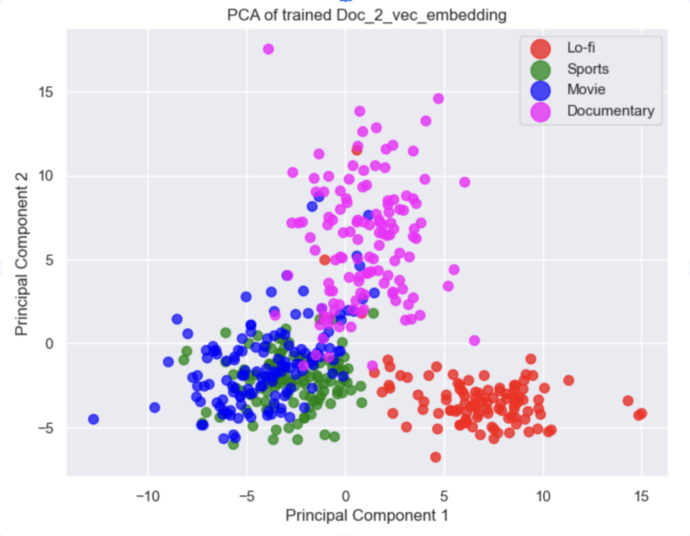

# YouTube Comment Analyzer: Analyzing Comments for Genre Classification

### Executive Summary
This project aims to enhance YouTube's video recommendation algorithm by incorporating textual analysis of user comments. Unlike YouTube's current model, which does not utilize comment text, our approach involves embedding YouTube video comments into a vector space using word2vec and doc2vec techniques to predict the genre of a video.

### Background and Domain Knowledge
Word embeddings represent words in a high-dimensional space, allowing for similarity analyses between them. Word2Vec creates vectors for individual words, while Doc2Vec, an extension of Word2Vec, develops vector representations for entire documents or video comments in our case. 

Our analysis focuses on determining the effectiveness of these embedding techniques in classifying YouTube videos into genres based on their comments.

Dataset
Our dataset comprises comments from 500 YouTube videos across four genres: Lo-fi, Sports, Movies, and Documentaries. With approximately 457k tokens, this dataset enables a detailed analysis of textual patterns across different video types.

Project Flow
The project starts with data preparation, including NLP processes like stopword removal, stemming, lemmatization, and tokenization. We then convert words into vectors using either word2vec or doc2vec methods and proceed to analyze and classify the YouTube video comments into respective genres.

### Analysis
The analysis section includes:

- A distribution of videos across genres.
- Word frequency and word cloud visualizations for each genre.
- PCA (Principal Component Analysis) for dimensionality reduction and visualization.

### PCA plot

### Models Used
We implemented Logistic Regression, Decision Tree, and Random Forest algorithms, assessing their performance in genre classification based on comment analysis. The Random Forest model showed notable accuracy with an F-1 score of 0.93.

### Recommendations and Business Value
The findings suggest that incorporating comment-based textual data could significantly refine YouTube's recommendation algorithm, enhancing user experience through more personalized and relevant content suggestions.

Summary and Conclusions
The project demonstrates the potential of using YouTube comments for improving video genre classification, recommending the integration of textual analysis into YouTube's recommendation system.

